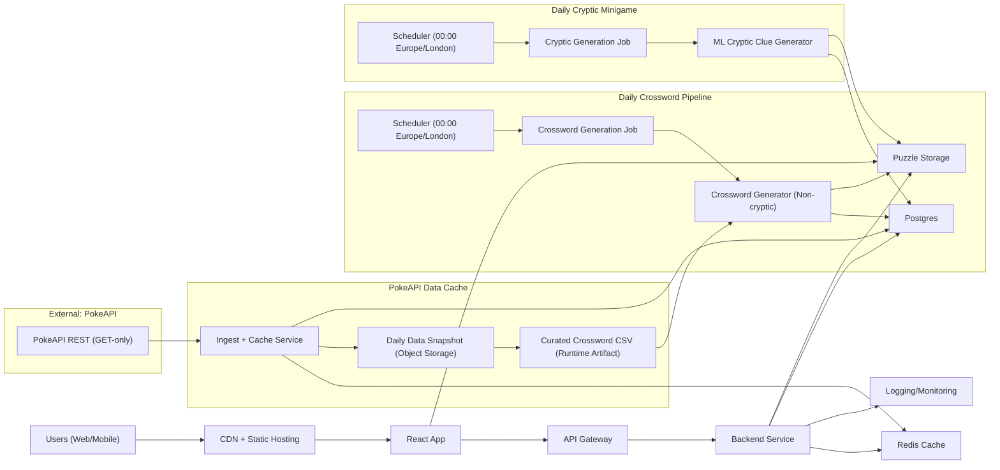

# Pokeleximon PRD

## 1. Summary
Pokeleximon is a Pokemon-themed daily word-games web app inspired by NYT Games and Pokedoku. It ships a crisp, modern React UI optimized for desktop and mobile browsers. The flagship game is a daily crossword published at 00:00 local UK time (Europe/London). A separate daily cryptic minigame uses ML-generated cryptic clues; the main crossword uses standard (non-cryptic) clueing only. Canonical Pokemon facts are sourced from PokeAPI, cached/snapshotted offline, and transformed into curated runtime artifacts (including the crossword answer/clue CSV) to respect fair-use guidance and improve operational reliability.

## 2. Goals
- Deliver a high-quality daily Pokemon crossword with a polished, mobile-first UX.
- Publish a new crossword every day at 00:00 Europe/London (DST-aware).
- Provide a distinct daily cryptic minigame backed by ML clue generation.
- Build an extensible platform for future games (e.g., Connections-style).
- Ensure PokeAPI usage is efficient, cached, and fair-use compliant.

## 3. Non-Goals (MVP)
- User accounts or authentication.
- Paid subscriptions or monetization.
- Social or multiplayer features.
- Native mobile apps (web only).

## 4. Target Users
- Pokemon fans who enjoy word and logic puzzles.
- Casual puzzle solvers on mobile devices.
- Enthusiast solvers seeking a daily ritual.

## 5. Key Features
### MVP
- Daily Pokemon crossword with standard (non-cryptic) clues.
- Puzzle solver UI: grid, clues panel, navigation, check/reveal, timer.
- Daily puzzle archive indexed by date.
- Local progress persistence in browser storage.
- Automated daily publishing pipeline at 00:00 Europe/London.
- Admin console for reviewing generated puzzles.

### Phase 2
- Daily cryptic minigame with ML-generated cryptic clues.
- Optional player accounts and cloud progress sync.
- Player stats (streaks, solve times, completion rates).
- Additional games (Connections-style).

## 6. User Experience Requirements
- Responsive design with touch-friendly controls.
- Fast load time (target <2s on mobile LTE).
- Accessibility: keyboard navigation, ARIA labels, high-contrast mode.
- Smooth navigation between games and archive.

## 7. Functional Requirements
### 7.1 Crossword Generation (Main Game)
- Generate a valid crossword grid and fill using a curated Pokemon word list.
- Use standard clueing derived from curated crossword artifacts produced from
  PokeAPI-derived data (species names, types, moves, items, locations, etc.).
- Crossword runtime generation must use curated local artifacts (CSV) and must
  not depend on live PokeAPI calls.
- Validate puzzle quality: uniqueness, fill ratio, theming, word length balance.
- Difficulty is a fixed target overall, with natural day-to-day variance.
- Store generated puzzle in DB and object storage.
- Maintain a fallback reserve of 5 puzzles if generation fails.

### 7.2 Cryptic Minigame (Separate)
- Daily cryptic puzzle uses ML-generated cryptic clues.
- Uses a distinct pipeline isolated from main crossword generator.
- Provides cryptic clue explanations for validation and learning (optional).

### 7.3 Publishing
- Scheduler triggers puzzle generation before daily publish time.
- Publish at 00:00 Europe/London (DST-aware).
- Archive all historical puzzles.
- Generation failures should trigger an alert (replenishment process TBD).

### 7.4 PokeAPI Usage
- Canonical game data originates from PokeAPI.
- PokeAPI is consumption-only (HTTP GET), no auth required, and has no enforced rate limits, but requests should be limited to reduce hosting costs.
- Implement a local cache and periodic snapshot/refresh job to minimize API calls and refresh offline generation inputs.
- Periodic refresh output should regenerate local derived artifacts (wordlists/corpora/curated crossword CSV) used by runtime systems.
- Avoid repeated calls for the same resources, consistent with the fair-use policy.

## 8. Data & Domain Model (Current v1)
- Puzzle: id, date, game_type, title, published_at, timezone, grid, entries, metadata.
- GenerationJob: id, type, date, status, started_at, finished_at, logs_url, model_version.
- PokeDataCache: resource_type, resource_id, payload, cached_at, etag.
- OperationalAlert: alert_type, game_type, severity, message, details, dedupe_key, resolved_*.
- CrypticCandidate: ranked cryptic candidate metadata for training/review.
- CrypticFeedback: telemetry events for cryptic gameplay.
- CrosswordFeedback: telemetry events for crossword gameplay.
- CrypticModelRegistry: trained model versions and activation state.

## 9. API Contract (v1, Code-First)
### 9.1 Conventions
- Base URL: `/api/v1` (health also exposed at `/health`).
- Date strings use `YYYY-MM-DD` in Europe/London local date unless stated.
- Timestamps are ISO 8601 with timezone offset.
- Game types: `crossword`, `cryptic`.
- Public puzzle payloads include answers by default; set `redact_answers=true` to hide answers.
- Most admin `POST` endpoints currently accept **query parameters** (not JSON bodies), except telemetry routes.
- Admin endpoints require token auth via `X-Admin-Token` (or `Authorization: Bearer`).

### 9.2 Public Endpoints
1. `GET /api/v1/health` (alias: `GET /health`)
   - Returns service status/version.
2. `GET /api/v1/puzzles/daily`
   - Query: `date?`, `gameType=crossword|cryptic`, `redact_answers?`.
   - Returns `{ data: Puzzle, meta: { redactedAnswers } }`.
3. `GET /api/v1/puzzles/{puzzle_id}`
   - Query: `redact_answers?`.
   - Returns `{ data: Puzzle, meta }`.
4. `GET /api/v1/puzzles/archive`
   - Query: `gameType?`, `cursor?`, `limit?` (server clamps to `1..100`).
   - Cursor format: `<YYYY-MM-DD>|<puzzle_id>`.
   - Returns `{ data: ArchivePage }`.
5. `GET /api/v1/puzzles/{puzzle_id}/metadata`
   - Returns `{ data: PuzzleSummary }`.
6. `POST /api/v1/puzzles/cryptic/telemetry`
   - Body: `CrypticTelemetryRequest`.
   - Event types: `page_view | clue_view | guess_submit | check_click | reveal_click | abandon`.
   - Returns `{ data: CrypticTelemetryEvent }`.
7. `POST /api/v1/puzzles/crossword/telemetry`
   - Body: `CrosswordTelemetryRequest`.
   - Event types: `page_view | clue_view | first_input | check_entry | check_all | reveal_all | clear_all | completed | abandon`.
   - Returns `{ data: CrosswordTelemetryEvent }`.
8. `POST /api/v1/puzzles/client-errors`
   - Body: `ClientErrorRequest`.
   - Frontend unhandled errors/rejections ingestion endpoint.
   - Returns `{ ok: true }`.

### 9.3 Admin/Service Endpoints (Internal)
1. `POST /api/v1/admin/generate`
   - Query: `date`, `gameType`, `force?`.
   - Returns `{ jobId, status }`.
2. `POST /api/v1/admin/publish`
   - Query: `date`, `gameType`.
   - Returns publish status payload (reserve count, low-reserve flags, etc.).
3. `POST /api/v1/admin/publish/daily`
   - Query: `gameType`, `date?` (defaults to current Europe/London date).
4. `POST /api/v1/admin/publish/rollback`
   - Query: `gameType`, `date?`, `sourceDate?`, `reason?`, `executedBy?`.
   - One-click recovery path to replace/restore the daily puzzle from a known-good published source.
5. `GET /api/v1/admin/reserve`
   - Query: `gameType?`.
   - Returns `{ items: ReserveStatus[], timezone }`.
6. `GET /api/v1/admin/analytics/summary`
   - Query: `days?` (`1..365`, default `30`).
   - Returns analytics summary (DAU series + crossword completion/median/drop-off).
7. `POST /api/v1/admin/reserve/topup`
   - Query: `gameType?`, `targetCount?` (`1..365`).
8. `POST /api/v1/admin/cryptic/generate`
   - Query: `answerKey?`, `limit?`, `topK?`, `includeInvalid?`.
9. `POST /api/v1/admin/cryptic/train-ranker`
   - Query: `promote?`, `notes?`.
10. `GET /api/v1/admin/cryptic/models`
   - Query: `limit?`.
11. `GET /api/v1/admin/cryptic/training-readiness`
   - Query: `minLabeledSamples?`, `minTotalEvents?`.
12. `POST /api/v1/admin/cryptic/models/{model_version}/activate`
   - Returns `{ item }` or `404`.
13. `GET /api/v1/admin/alerts`
   - Query: `gameType?`, `alertType?`, `limit?`, `includeResolved?`.
   - Returns `{ items: OperationalAlert[] }`.
14. `POST /api/v1/admin/alerts/{alert_id}/resolve`
   - Query: `resolvedBy?`, `note?`.
   - Returns `{ item }` or `404`.
15. `GET /api/v1/admin/jobs`
   - Query: `status?`, `type?`, `date?`, `limit?`.
   - Returns `{ items: GenerationJob[] }`.
16. `GET /api/v1/admin/jobs/{job_id}`
   - Returns `{ item }` or `404`.
17. `POST /api/v1/admin/puzzles/{puzzle_id}/approve`
   - Query: `reviewedBy?`, `note?`.
   - Returns `{ item }` or `404`.
18. `POST /api/v1/admin/puzzles/{puzzle_id}/reject`
   - Query: `reviewedBy?`, `note?`, `regenerate?`.
   - Returns `{ item, regenerate }` or `404/409`.

### 9.4 Example Responses
```json
{
  "data": {
    "id": "puz_3f3c2a2e",
    "date": "2026-02-10",
    "gameType": "crossword",
    "title": "Electric Sparks",
    "publishedAt": "2026-02-10T00:00:00+00:00",
    "timezone": "Europe/London",
    "grid": {
      "width": 15,
      "height": 15,
      "cells": [
        { "x": 0, "y": 0, "isBlock": false, "solution": "P", "entryIdAcross": "a1", "entryIdDown": "d1" }
      ]
    },
    "entries": [
      {
        "id": "a1",
        "direction": "across",
        "number": 1,
        "answer": "PIKACHU",
        "clue": "Electric-type mascot",
        "length": 7,
        "cells": [[0, 0], [1, 0], [2, 0], [3, 0], [4, 0], [5, 0], [6, 0]],
        "sourceRef": "pokemon/25",
        "mechanism": null,
        "enumeration": "7"
      }
    ],
    "metadata": {
      "difficulty": "easy",
      "themeTags": ["electric", "mascot"],
      "source": "curated",
      "generatorVersion": "reserve-generator-0.3"
    }
  },
  "meta": {
    "redactedAnswers": false
  }
}
```

## 10. Data Schemas (v1)
### 10.1 Puzzle
- `id`: string, unique puzzle id.
- `date`: string, `YYYY-MM-DD` (Europe/London).
- `gameType`: `crossword | cryptic`.
- `title`: string.
- `publishedAt`: ISO 8601 timestamp.
- `timezone`: string.
- `grid`: Grid.
- `entries`: Entry[].
- `metadata`: PuzzleMetadata.

### 10.2 Grid
- `width`: integer.
- `height`: integer.
- `cells`: Cell[].

### 10.3 Cell
- `x`: integer (0-based).
- `y`: integer (0-based).
- `isBlock`: boolean.
- `solution`: string (single letter) or null.
- `entryIdAcross`: string or null.
- `entryIdDown`: string or null.

### 10.4 Entry
- `id`: string (e.g., `a1`, `d7`).
- `direction`: `across | down`.
- `number`: integer.
- `answer`: string.
- `clue`: string.
- `length`: integer.
- `cells`: array of `[x, y]`.
- `sourceRef`: string or null.
- `mechanism`: string or null.
- `enumeration`: string or null.

### 10.5 PuzzleMetadata
- `difficulty`: `easy | medium | hard`.
- `themeTags`: string[].
- `source`: `pokeapi | curated`.
- `generatorVersion`: string or null.

### 10.6 PuzzleSummary
- `id`: string.
- `date`: `YYYY-MM-DD`.
- `gameType`: `crossword | cryptic`.
- `title`: string.
- `difficulty`: `easy | medium | hard`.
- `publishedAt`: ISO 8601 timestamp.

### 10.7 ArchivePage
- `items`: PuzzleSummary[].
- `cursor`: string or null.
- `hasMore`: boolean.

### 10.8 GenerationJob
- `id`: string.
- `type`: string.
- `date`: `YYYY-MM-DD` or null.
- `status`: `queued | running | succeeded | failed`.
- `startedAt`: ISO 8601 timestamp or null.
- `finishedAt`: ISO 8601 timestamp or null.
- `logs`: string or null.
- `modelVersion`: string or null.
- `createdAt`: ISO 8601 timestamp or null.

### 10.9 OperationalAlert
- `id`: integer.
- `alertType`: string.
- `gameType`: `crossword | cryptic`.
- `severity`: string.
- `message`: string.
- `details`: object.
- `dedupeKey`: string.
- `resolvedAt`: ISO 8601 timestamp or null.
- `resolvedBy`: string or null.
- `resolutionNote`: string or null.
- `createdAt`: ISO 8601 timestamp or null.

### 10.10 CrypticTelemetryRequest
- `puzzleId`: string.
- `eventType`: `page_view | clue_view | guess_submit | check_click | reveal_click | abandon`.
- `sessionId`: string or null.
- `candidateId`: integer or null.
- `eventValue`: object (default `{}`).
- `clientTs`: ISO 8601 timestamp or null.

### 10.11 CrosswordTelemetryRequest
- `puzzleId`: string.
- `eventType`: `page_view | clue_view | first_input | check_entry | check_all | reveal_all | clear_all | completed | abandon`.
- `sessionId`: string or null.
- `eventValue`: object (default `{}`).
- `clientTs`: ISO 8601 timestamp or null.

### 10.12 AnalyticsSummary
- `windowDays`: integer.
- `timezone`: string.
- `dailyActiveUsers`: `{ latest, average, series[{date, users}] }`.
- `crossword`: `{ pageViewSessions, completedSessions, completionRate, medianSolveTimeMs, dropoffByEventType[] }`.

### 10.13 Error
- `code`: string (optional; endpoint-dependent).
- `message`: string (or FastAPI `detail`).
- `details`: object (optional).

## 11. ML Requirements (Cryptic Minigame)
- Model generates candidate cryptic clues for target answers.
- Post-processing filters for quality and clueing rules.
- Optional human review queue for early-stage quality control.

## 12. Non-Functional Requirements
- Availability: 99.5% uptime.
- Scalability: handle daily traffic spikes around publish time.
- Security: admin token auth on internal routes, endpoint rate limiting (public + admin), least-privilege secrets handling.
- Observability: centralized logs, alert webhooks, backend Sentry-compatible capture, frontend client-error ingestion.

## 13. Analytics (MVP)
- Daily active users.
- Completion rate per puzzle.
- Median solve time.
- Drop-off points in solver UI.

## 14. Tech Stack Recommendations
### Frontend
- React + TypeScript + Vite.
- CSS: modern, crisp style system (custom design tokens).

### Backend
- API: FastAPI (Python) or Node.js (Express/NestJS).
- Jobs: Celery/RQ (Python) or BullMQ (Node).
- Database: Postgres.
- Cache: Redis (for puzzle cache and PokeAPI resource cache).

### ML / Generation
- Python services for crossword generation and cryptic clue ML.

### Hosting (Cloud)
- Frontend: CDN + static hosting (e.g., S3 + CloudFront or Vercel).
- Backend: containerized services (ECS/Fargate or Cloud Run).
- Jobs: Cloud scheduler + job queue.

## 15. Timeline (High-Level)
1. MVP crossword UI + static puzzle loading.
2. Crossword generator + publish pipeline.
3. Archive + admin tools.
4. Cryptic minigame MVP.
5. Accounts + stats.

## 16. Risks & Mitigations
- Low-quality generated puzzles: maintain a curated fallback reserve.
- ML cryptic clues unreliable: keep cryptic as separate minigame and optional.
- PokeAPI load concerns: cache aggressively and use local snapshots.

## 17. Decisions (Confirmed)
- Daily crossword uses a fixed target difficulty, with natural variance.
- Fallback reserve size: 5 puzzles.
- Cryptic minigame is daily.
- Crossword runtime source of truth is curated CSV derived from offline PokeAPI refresh pipelines.

---

## Architecture Diagram


